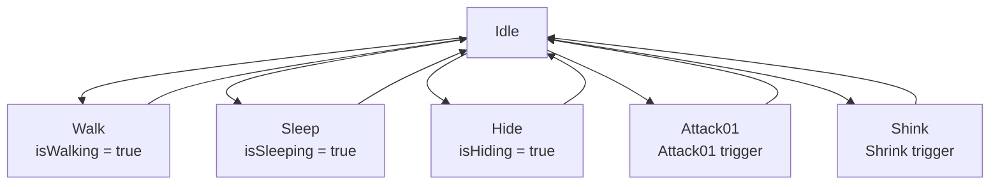

# 📋 Documentação do Animator Controller - Slime Player

## 🎮 Visão Geral

O **plc_slime03.controller** é o controlador de animação principal para o personagem Slime em um jogo de aventura 2D top-down. Este documento detalha todos os estados, variáveis e transições do sistema de animação.

---

## 🎛️ Parâmetros do Animator

### Bool Parameters (Estado Contínuo)

| Parâmetro | Tipo | Valor Padrão | Descrição |
|-----------|------|--------------|-----------|
| `isSleeping` | Bool | false | Controla se o slime está dormindo |
| `isHiding` | Bool | false | Controla se o slime está escondido |
| `isWalking` | Bool | false | Controla se o slime está em movimento |
| `FacingRight` | Bool | true | Direção que o slime está olhando |

### Trigger Parameters (Ação Pontual)

| Parâmetro | Tipo | Descrição |
|-----------|------|-----------|
| `Shrink` | Trigger | Dispara animação de encolher |
| `Attack01` | Trigger | Dispara animação de ataque |

### Parâmetros Sugeridos (Expansão)

| Parâmetro | Tipo | Descrição |
|-----------|------|-----------|
| `isHurt` | Bool | Estado de recebimento de dano |
| `isDead` | Bool | Estado de morte |
| `SpecialAttack` | Trigger | Ataque especial |
| `Heal` | Trigger | Animação de cura |
| `Talk` | Trigger | Animação de conversa |

---

## 🎭 Estados do Animator

### 🏠 Estados Principais (Core Gameplay)

#### 1. **Idle** `(20, 440)`

- **Função:** Estado central/hub de transições
- **Animação:** Respiração suave, olhos piscando
- **Comportamento:** Estado padrão quando não há input
- **Loop:** Sim

#### 2. **Walk** `(20, 540)`

- **Função:** Movimento omnidirecional
- **Animação:** Ciclo de caminhada fluido
- **Comportamento:** Ativado por input de movimento
- **Loop:** Sim

#### 3. **Sleep** `(-250, 440)`

- **Função:** Estado de descanso/recarregar energia
- **Animação:** Ronco suave, movimento respiratório
- **Comportamento:** Pode restaurar HP/MP lentamente
- **Loop:** Sim

#### 4. **Hide** `(-200, 330)`

- **Função:** Stealth/evitar inimigos
- **Animação:** Slime se achata/transparente
- **Comportamento:** Reduz detecção por inimigos
- **Loop:** Sim

### ⚔️ Estados de Ação

#### 5. **Attack01** `(280, 450)`

- **Função:** Ataque básico corpo-a-corpo
- **Animação:** Expansão súbita do slime
- **Duração:** ~0.8s
- **Comportamento:** Causa dano em área ao redor
- **Loop:** Não

#### 6. **Shink** `(-250, 540)` *(nome original mantido)*

- **Função:** Encolher/evasão rápida
- **Animação:** Compressão seguida de movimento rápido
- **Duração:** ~0.8s
- **Comportamento:** Movimento rápido com i-frames
- **Loop:** Não

#### 7. **Hit** `(700, 190)`

- **Função:** Reação ao receber dano
- **Animação:** Deformação e knockback
- **Duração:** ~0.5s
- **Comportamento:** Breve invencibilidade
- **Loop:** Não

#### 8. **Dying** `(70, 320)`

- **Função:** Animação de morte
- **Animação:** Dissolução gradual do slime
- **Duração:** ~2.0s
- **Comportamento:** Estado final sem retorno
- **Loop:** Não

### 🏃 Estados de Movimento Especial

#### 9. **Jump** `(660, 290)`

- **Função:** Pulo/superação de obstáculos
- **Animação:** Estiramento vertical
- **Duração:** ~1.0s
- **Comportamento:** Movimento vertical
- **Loop:** Não

### 😊 Estados Emocionais/Expressivos

#### 10. **Happy** `(235, 65)`

- **Função:** Expressão de alegria
- **Animação:** Bouncing animado, brilho
- **Triggers:** Coletar item, level up, vitória
- **Loop:** Sim (com duração limitada)

#### 11. **Sad** `(490, 70)`

- **Função:** Expressão de tristeza
- **Animação:** Slime murcho, cor escurecida
- **Triggers:** Perder vida, falhar objetivo
- **Loop:** Sim (com duração limitada)

#### 12. **Eating** `(550, 130)`

- **Função:** Consumir itens/comida
- **Animação:** Mastigação, crescimento temporário
- **Triggers:** Usar item consumível
- **Loop:** Não

#### 13. **Focus** `(585, 715)`

- **Função:** Concentração/carregamento
- **Animação:** Pulsação rítmica, aura energética
- **Triggers:** Carregar ataque especial, magia
- **Loop:** Sim

### 🔧 Estados de Sistema

#### 14. **Start** `(-110, 260)`

- **Função:** Estado de entrada do sistema
- **Animação:** Materialização do slime
- **Comportamento:** Transição automática para Idle
- **Loop:** Não

#### 15. **Waking** `(-250, 440)`

- **Função:** Transição de sono para acordado
- **Animação:** Espreguiçar, bocejar
- **Duração:** ~1.5s
- **Loop:** Não

---

## 🔗 Sistema de Transições

### 🏠 Hub Central: IDLE



### 📋 Transições Detalhadas

#### **A partir do IDLE:**

| Para | Condição | Tipo | Duração |
|------|----------|------|---------|
| Walk | `isWalking = true` | Condicional | 0.1s |
| Sleep | `isSleeping = true` | Condicional | 0.3s |
| Hide | `isHiding = true` | Condicional | 0.2s |
| Attack01 | `Attack01 trigger` | Trigger | 0.0s |
| Shink | `Shrink trigger` | Trigger | 0.0s |
| Jump | `Jump trigger` | Trigger | 0.0s |

#### **A partir do WALK:**

| Para | Condição | Tipo | Duração |
|------|----------|------|---------|
| Idle | `isWalking = false` | Condicional | 0.1s |
| Attack01 | `Attack01 trigger` | Trigger | 0.0s |
| Shink | `Shrink trigger` | Trigger | 0.0s |
| Jump | `Jump trigger` | Trigger | 0.0s |
| Hit | `isHurt = true` | Condicional | 0.0s |

#### **Transições de Retorno Automático:**

| De | Para | Condição | Exit Time |
|----|------|----------|-----------|
| Attack01 | Idle | Automática | 0.8s |
| Shink | Idle | Automática | 0.8s |
| Hit | Idle | Automática | 0.5s |
| Jump | Idle | Automática | 1.0s |
| Waking | Idle | Automática | 1.5s |
| Eating | Idle | Automática | 1.2s |

#### **Estados Contínuos:**

| De | Para | Condição |
|----|------|----------|
| Sleep | Waking | `isSleeping = false` |
| Hide | Idle | `isHiding = false` |
| Hide | Walk | `isWalking = true` |

---

## 🎯 Transições Sugeridas (Expansões)

### ⚔️ Sistema de Combate Avançado

```csharp
// Combos de ataque
Attack01 → SpecialAttack  // Se SpecialAttack trigger durante Attack01
SpecialAttack → Idle      // Exit time: 1.5s

// Defesa
Any State → Block         // Block trigger + isBlocking = true
Block → Idle             // isBlocking = false
```

### 🏃 Sistema de Movimento Avançado

```csharp
// Parede/obstáculos
Walk → WallSlide         // Detectar parede + input direção
WallSlide → Jump         // Jump trigger
WallSlide → Idle         // Sem input
```

### 💊 Sistema de Status/Saúde

```csharp
// Cura
Any State → Heal         // Heal trigger
Heal → Previous State    // Exit time: 2.0s

// Morte
Any State → Dying        // isDead = true
Dying → GameOver         // Exit time: 2.0s (não retorna)

// Dano
Any State → Hit          // isHurt = true (interrupção)
Hit → Previous State     // Exit time: 0.5s
```

### 🎭 Sistema de Emoções Expandido

```csharp
// Emoções automáticas
Victory → Happy          // Automática após completar objetivo
LowHealth → Sad          // HP < 25%
PowerUp → Focus          // Coletar power-up

// Transições de emoção
Happy → Idle             // Exit time: 3.0s
Sad → Idle               // Exit time: 2.0s
Focus → Idle             // Exit time: 1.0s
```

### 🌟 Sistema de Habilidades Especiais

```csharp
// Transformações temporárias
Idle → Transform         // Transform trigger
Transform → SuperForm    // Automática
SuperForm → Any Combat   // Ataques especiais disponíveis
SuperForm → Idle         // Exit time: 10.0s

// Stealth avançado
Hide → Invisible         // Manter Hide por 3s
Invisible → SneakAttack  // Attack01 trigger
SneakAttack → Idle       // Exit time: 1.0s
```

---

## 🔧 Implementação Técnica

### 📝 Script de Controle Recomendado

```csharp
public class SlimeAnimatorController : MonoBehaviour 
{
    private Animator animator;
    
    // Parâmetros para performance
    private static readonly int IsWalking = Animator.StringToHash("isWalking");
    private static readonly int IsSleeping = Animator.StringToHash("isSleeping");
    private static readonly int Attack01 = Animator.StringToHash("Attack01");
    
    void UpdateMovementAnimations() 
    {
        bool walking = movement.IsMoving();
        animator.SetBool(IsWalking, walking);
    }
    
    void TriggerAttack() 
    {
        if (CanAttack()) 
        {
            animator.SetTrigger(Attack01);
        }
    }
}
```

### ⚡ Otimizações

- **String to Hash:** Usar `Animator.StringToHash()` para parâmetros
- **Update Frequency:** Parâmetros Bool atualizados apenas quando necessário
- **Layer Weights:** Considerar layers separados para facial/body
- **Culling:** Desabilitar animator quando fora da tela

---

## 🎮 Integração com Gameplay

### 🎯 Input Mapping

| Input | Ação | Parâmetro Animator |
|-------|------|-------------------|
| WASD/Arrow Keys | Movimento | `isWalking` |
| Space/Mouse1 | Ataque | `Attack01` trigger |
| Shift/Mouse2 | Encolher | `Shrink` trigger |
| Ctrl/C | Esconder | `isHiding` |
| Z/Sleep | Dormir | `isSleeping` |

### 🔊 Audio Integration

| Estado | Som | Trigger |
|--------|-----|---------|
| Walk | Passos | Loop enquanto isWalking |
| Attack01 | Som de ataque | No início da animação |
| Hit | Som de dor | No início da animação |
| Shrink | Som de encolher | No início da animação |

### 🎨 VFX Integration

| Estado | Efeito Visual | Timing |
|--------|---------------|--------|
| Attack01 | Onda de choque | 50% da animação |
| Shrink | Rastro de movimento | Durante encolhimento |
| Happy | Partículas brilhantes | Loop |
| Focus | Aura pulsante | Loop |

---

## 🐛 Debug e Troubleshooting

### 🔍 Problemas Comuns

1. **Transições não funcionam:** Verificar spelling dos parâmetros
2. **Animações travadas:** Verificar exit times e condições
3. **Performance baixa:** Usar StringToHash para parâmetros

### 🛠️ Ferramentas de Debug

- **Animator Window:** Visualizar transições em tempo real
- **Console Logs:** Logar mudanças de parâmetros
- **Gizmos:** Visualizar estados no Scene view

---

## 📚 Referencias e Recursos

### 🔗 Links Úteis

- [Unity Animator Documentation](https://docs.unity3d.com/Manual/class-AnimatorController.html)
- [Animation Best Practices](https://docs.unity3d.com/Manual/AnimationBestPractice.html)
- [State Machine Behaviors](https://docs.unity3d.com/Manual/StateMachineBehaviours.html)

### 📖 Padrões Recomendados

- **Naming Convention:** PascalCase para estados, camelCase para parâmetros
- **Organization:** Agrupar estados por função (Movement, Combat, Emotion)
- **Documentation:** Comentar transições complexas no Animator

---

*Documento criado para SlimeKing v1.0 - Atualizado em Agosto 2025*
