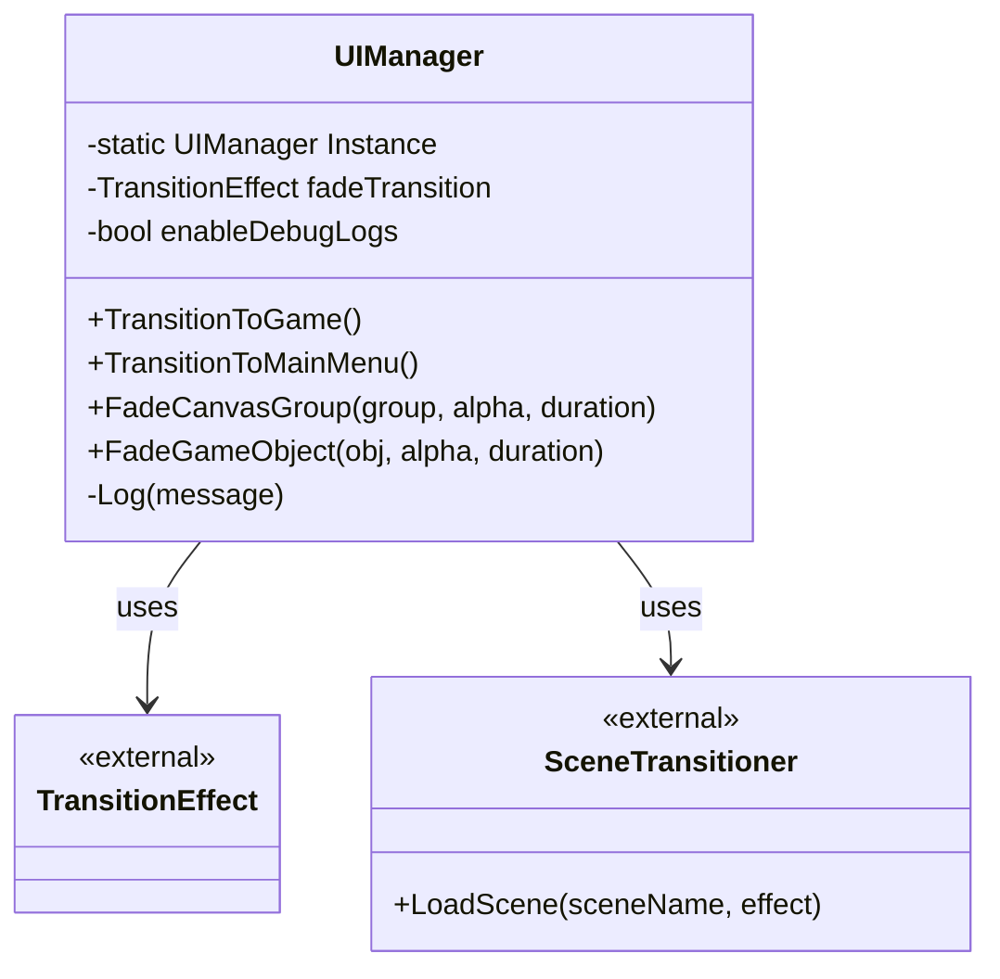
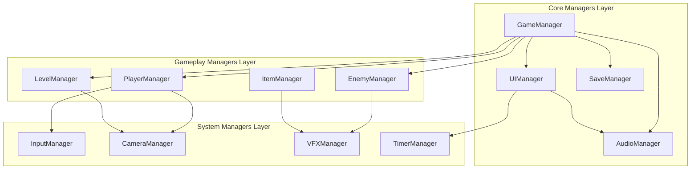

# 📋 **UIManager - Documentação Técnica**

## 🎯 **Visão Geral**

O `UIManager` é um **Singleton** responsável por gerenciar operações globais de interface e transições visuais no jogo **The Slime King**. Ele fornece uma API centralizada para transições de cena e efeitos de fade.

---

## 🏗️ **Arquitetura do UIManager**



---

## 📁 **Estrutura do Arquivo**

### **Localização**

```
Assets/Scripts/Systems/UI/UIManager.cs
```

### **Namespace**

```csharp
SlimeKing.Systems.UI
```

### **Dependências**

- `UnityEngine`
- `System.Collections`
- `PixeLadder.EasyTransition` (Plugin externo)

---

## 🔧 **Componentes Principais**

### **1. Singleton Pattern**

```csharp
public static UIManager Instance { get; private set; }

private void Awake()
{
    if (Instance == null)
    {
        Instance = this;
        DontDestroyOnLoad(gameObject);
        Log("UIManager initialized");
    }
    else
    {
        Destroy(gameObject);
    }
}
```

**Características:**

- ✅ **Thread-safe** para uso em runtime
- ✅ **Persist entre cenas** com `DontDestroyOnLoad`
- ✅ **Auto-destruição** de instâncias duplicadas
- ✅ **Log de inicialização** para debug

---

### **2. Scene Transitions**

#### **TransitionToGame()**

```csharp
public void TransitionToGame()
{
    Log("Transitioning to game scene");

    if (fadeTransition != null && SceneTransitioner.Instance != null)
    {
        SceneTransitioner.Instance.LoadScene("GameScene", fadeTransition);
    }
    else
    {
        // Fallback - carrega cena diretamente
        UnityEngine.SceneManagement.SceneManager.LoadScene("GameScene");
    }
}
```

#### **TransitionToMainMenu()**

```csharp
public void TransitionToMainMenu()
{
    Log("Transitioning to main menu");

    if (fadeTransition != null && SceneTransitioner.Instance != null)
    {
        SceneTransitioner.Instance.LoadScene("TitleScreen", fadeTransition);
    }
    else
    {
        // Fallback - carrega cena diretamente
        UnityEngine.SceneManagement.SceneManager.LoadScene("TitleScreen");
    }
}
```

**Características:**

- ✅ **Sistema de fallback** quando EasyTransition não está disponível
- ✅ **Transições suaves** usando efeitos visuais
- ✅ **Logging** para debug de transições
- ✅ **Cenas alvo fixas** mas facilmente configuráveis

---

### **3. Fade Utilities**

#### **FadeCanvasGroup()**

```csharp
public IEnumerator FadeCanvasGroup(CanvasGroup group, float targetAlpha, float duration)
```

**Funcionalidades:**

- 🎨 **Fade suave** em elementos UI
- 🔒 **Gerenciamento de interação** durante fade
- ⚡ **Otimizado** para CanvasGroups
- 🎯 **Controle preciso** de alpha

**Fluxo de Execução:**

1. Verifica se `group` não é null
2. Bloqueia interações (`interactable = false`, `blocksRaycasts = false`)
3. Executa fade gradual usando `Mathf.Lerp`
4. Reabilita interações se `targetAlpha > 0`

#### **FadeGameObject()**

```csharp
public IEnumerator FadeGameObject(GameObject obj, float targetAlpha, float duration)
```

**Funcionalidades:**

- 🖼️ **Suporte múltiplo**: SpriteRenderers e UI Images
- 🔄 **Batch processing** de componentes filhos
- 💾 **Preserva valores iniciais** de alpha
- 🎯 **Fade simultâneo** de todos os componentes

**Fluxo de Execução:**

1. Coleta todos SpriteRenderers e Images do objeto e filhos
2. Armazena valores iniciais de alpha
3. Executa fade gradual em todos os componentes
4. Define valores finais precisos

---

### **4. Debug System**

```csharp
[System.Diagnostics.Conditional("UNITY_EDITOR")]
[System.Diagnostics.Conditional("DEVELOPMENT_BUILD")]
private void Log(string message)
{
    if (enableDebugLogs)
    {
        Debug.Log($"[UIManager] {message}");
    }
}
```

**Características:**

- 🐛 **Conditional compilation** - removido em builds finais
- 🔧 **Configurável** via Inspector (`enableDebugLogs`)
- 📝 **Formato padronizado** com prefixo `[UIManager]`
- ⚡ **Zero overhead** em builds de produção

---

## ⚙️ **Configuração no Inspector**

### **Campos Serializados**

| **Campo** | **Tipo** | **Descrição** | **Obrigatório** |
|-----------|----------|---------------|-----------------|
| `fadeTransition` | `TransitionEffect` | Efeito usado em transições de cena | ❌ Opcional |
| `enableDebugLogs` | `bool` | Ativa/desativa logs de debug | ❌ Padrão: true |

### **Configuração Recomendada**

```
UIManager GameObject:
├── UIManager (Script)
│   ├── Fade Transition: [Assign TransitionEffect]
│   └── Enable Debug Logs: ✓ (Development only)
└── Transform (Root)
```

---

## 🔗 **Integração com Outros Sistemas**

### **Dependências Externas**

#### **EasyTransition Plugin**

```csharp
// Usado para transições visuais entre cenas
SceneTransitioner.Instance.LoadScene(sceneName, fadeTransition);
```

#### **Unity Scene Management**

```csharp
// Fallback quando EasyTransition não está disponível
UnityEngine.SceneManagement.SceneManager.LoadScene(sceneName);
```

### **Sistemas que Usam UIManager**

1. **TitleScreenController**
   - Transições de menu para jogo
   - Fade de elementos UI

2. **GameManager**
   - Transições entre estados de jogo
   - Navegação entre cenas

3. **PauseManager**
   - Fade de overlays de pausa
   - Transições de menu

---

## 📊 **Performance e Otimização**

### **Otimizações Implementadas**

1. **Memory Management**
   - ✅ Singleton persiste entre cenas
   - ✅ Não cria objetos desnecessários
   - ✅ Reutiliza coroutines

2. **Rendering Optimization**
   - ✅ Desabilita raycasts durante fade
   - ✅ Batch processing de componentes
   - ✅ Usa `Mathf.Lerp` otimizado

3. **Debug Optimization**
   - ✅ Conditional compilation
   - ✅ Zero overhead em builds finais

### **Métricas Esperadas**

| **Operação** | **Performance** | **Memory** |
|--------------|----------------|------------|
| Transição de cena | ~1-2 frames | Mínimo |
| Fade CanvasGroup | 60 FPS | Baixo |
| Fade GameObject | 50-60 FPS | Médio |

---

## 🧪 **Casos de Uso**

### **1. Transição Básica de Cena**

```csharp
// De qualquer script
UIManager.Instance.TransitionToGame();
```

### **2. Fade de Menu**

```csharp
// Fade out de um menu
yield return StartCoroutine(UIManager.Instance.FadeCanvasGroup(menuGroup, 0f, 0.5f));
```

### **3. Fade de Splash Screen**

```csharp
// Fade in de logo
yield return StartCoroutine(UIManager.Instance.FadeGameObject(logoObject, 1f, 1f));
// Aguarda 2 segundos
yield return new WaitForSeconds(2f);
// Fade out
yield return StartCoroutine(UIManager.Instance.FadeGameObject(logoObject, 0f, 1f));
```

---

## ⚠️ **Limitações e Considerações**

### **Limitações Atuais**

1. **Cenas Hard-coded**
   - ❌ Nomes de cena fixos no código
   - 🔧 **Solução**: Criar enum ou ScriptableObject para cenas

2. **Single Transition Effect**
   - ❌ Apenas um efeito de transição configurável
   - 🔧 **Solução**: Dictionary de efeitos por tipo

3. **No Pooling System**
   - ❌ Não reutiliza objetos temporários
   - 🔧 **Solução**: Object pooling para elementos UI

### **Considerações de Design**

1. **Thread Safety**
   - ✅ Singleton é thread-safe
   - ⚠️ Coroutines devem rodar na main thread

2. **Error Handling**
   - ✅ Verificações de null adequadas
   - ⚠️ Não trata exceções de loading de cena

3. **Extensibilidade**
   - ✅ Fácil de adicionar novos métodos de fade
   - ✅ Sistema de logging configurável

---

## 🚀 **Roadmap de Melhorias**

### **Versão 1.1**

- [ ] Sistema de cenas configuráveis
- [ ] Multiple transition effects
- [ ] Callback system para transições

### **Versão 1.2**

- [ ] Object pooling para UI
- [ ] Animation curves para fades
- [ ] Audio integration durante transições

### **Versão 2.0**

- [ ] UI State management
- [ ] Modal system
- [ ] Notification system

---

## 📝 **Exemplo de Implementação Completa**

```csharp
// Exemplo de uso em TitleScreenController
public class TitleScreenController : MonoBehaviour
{
    private IEnumerator TitleSequence()
    {
        // 1. Fade in company logo
        yield return StartCoroutine(UIManager.Instance.FadeCanvasGroup(companyLogoGroup, 1f, 1f));
        
        // 2. Wait and fade out
        yield return new WaitForSeconds(3f);
        yield return StartCoroutine(UIManager.Instance.FadeCanvasGroup(companyLogoGroup, 0f, 1f));
        
        // 3. Show game elements
        yield return StartCoroutine(UIManager.Instance.FadeCanvasGroup(gameLogoGroup, 1f, 1f));
        
        // 4. Transition to game when input received
        if (inputReceived)
        {
            UIManager.Instance.TransitionToGame();
        }
    }
}
```

---

## ✅ **Checklist de Integração**

### **Setup Inicial**

- [ ] GameObject com UIManager na cena
- [ ] TransitionEffect configurado
- [ ] EasyTransition plugin importado
- [ ] Debug logs configurados

### **Testes**

- [ ] Transição para jogo funciona
- [ ] Transição para menu funciona
- [ ] Fade de CanvasGroup funciona
- [ ] Fade de GameObject funciona
- [ ] Fallbacks funcionam sem plugins

### **Produção**

- [ ] Debug logs desabilitados
- [ ] Performance testada
- [ ] Memory leaks verificados
- [ ] Build final testado

---

## 🏗️ **Arquitetura de Managers Singleton - The Slime King**

### 📋 **Visão Geral da Arquitetura**



### 🎯 **Hierarquia de Managers**

#### **Tier 1: Core Managers (Fundamentais)**

Essenciais para o funcionamento básico do jogo

#### **Tier 2: Gameplay Managers (Jogabilidade)**

Controlam mecânicas específicas do jogo

#### **Tier 3: System Managers (Sistemas)**

Funcionalidades auxiliares e suporte

### 📊 **Resumo da Arquitetura**

| **Manager** | **Tier** | **Responsabilidade** | **Dependências** |
|-------------|----------|---------------------|------------------|
| **GameManager** | Core | Coordenação geral | Nenhuma |
| **AudioManager** | Core | Sistema de áudio | Nenhuma |
| **UIManager** | Core | Interface e transições | Nenhuma |
| **SaveManager** | Core | Salvamento/carregamento | Nenhuma |
| **PlayerManager** | Gameplay | Estado do jogador | InputManager, CameraManager |
| **EnemyManager** | Gameplay | Controle de inimigos | PlayerManager |
| **LevelManager** | Gameplay | Progressão de fases | PlayerManager |
| **InputManager** | System | Entrada do usuário | Nenhuma |
| **CameraManager** | System | Controle de câmera | PlayerManager |

### ✅ **Benefícios desta Arquitetura**

1. **🔗 Baixo Acoplamento**: Managers são independentes quanto possível
2. **📈 Alta Coesão**: Cada manager tem responsabilidade bem definida
3. **🔄 Fácil Extensão**: Novos managers podem ser adicionados facilmente
4. **🐛 Fácil Debug**: Sistema hierárquico facilita identificação de problemas
5. **♻️ Reutilização**: Managers core podem ser reutilizados em outros projetos
6. **⚡ Performance**: Inicialização otimizada e lazy loading quando possível

---

**📅 Última atualização:** 12 de Outubro de 2025  
**🔖 Versão:** 1.0.0  
**👨‍💻 Desenvolvedor:** The Slime King Team
