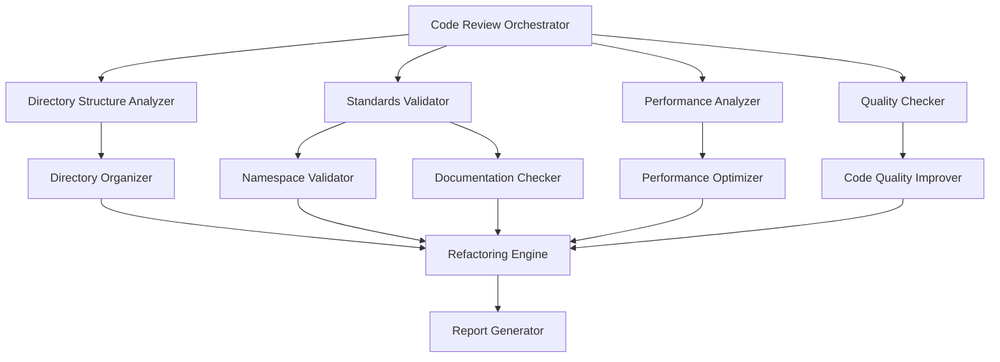

# Design Document

## Overview

The Code Review and Refactoring System is designed to systematically analyze, validate, and improve the SlimeKing Unity project's codebase according to established coding standards. The system operates through a multi-phase approach: analysis, validation, optimization, and automated refactoring.

## Architecture

The system follows a modular architecture with distinct components handling different aspects of code review:



### Core Components

1. **Code Review Orchestrator**: Main coordinator that manages the review process
2. **Analysis Components**: Specialized analyzers for different code aspects
3. **Validation Components**: Components that check compliance with standards
4. **Refactoring Engine**: Applies automated fixes and improvements
5. **Report Generator**: Creates detailed reports of findings and changes

## Components and Interfaces

### ICodeAnalyzer Interface

```csharp
public interface ICodeAnalyzer
{
    AnalysisResult Analyze(string filePath);
    bool CanAnalyze(string filePath);
    AnalysisType GetAnalysisType();
}
```

### ICodeValidator Interface

```csharp
public interface ICodeValidator
{
    ValidationResult Validate(AnalysisResult analysis);
    ValidationSeverity GetSeverity(ValidationIssue issue);
    bool CanFix(ValidationIssue issue);
}
```

### IRefactoringOperation Interface

```csharp
public interface IRefactoringOperation
{
    RefactoringResult Apply(string filePath, ValidationIssue issue);
    bool IsReversible();
    string GetDescription();
}
```

### Directory Structure Analyzer

Responsible for analyzing and validating directory organization:

- Scans `Assets/_Code` directory structure
- Compares against standards defined in `CodingStandards.md`
- Identifies empty directories for removal
- Validates naming conventions for folders
- Detects misplaced files

### Standards Validator

Validates code compliance with established standards:

- **Class Structure Validation**: Ensures proper ordering of using statements, namespace, XML docs, class declaration, and regions
- **Naming Convention Validation**: Checks PascalCase, camelCase, and UPPER_CASE usage
- **File Naming Validation**: Ensures proper suffixes and no emojis in filenames
- **XML Documentation Validation**: Verifies all public classes have proper documentation
- **Serialization Validation**: Prefers `[SerializeField] private` over public fields

### Performance Analyzer

Identifies performance optimization opportunities:

- **Distance Calculation Optimization**: Suggests `sqrMagnitude` over `Distance()`
- **Loop Optimization**: Flags `GameObject.Find()` and `FindObjectsOfType()` in loops
- **Magic Number Detection**: Identifies hardcoded values that should be constants
- **Method Length Analysis**: Flags methods exceeding 50 lines
- **Class Size Analysis**: Flags classes exceeding 500 lines

### Quality Checker

Ensures code quality and best practices:

- **Null Safety**: Adds null checks where needed
- **Bounds Checking**: Validates array/list access
- **Dead Code Detection**: Identifies commented code for removal
- **Debug Log Optimization**: Suggests conditional compilation for debug logs
- **Unity Best Practices**: Validates proper Undo system usage

### Namespace Validator

Ensures proper namespace organization:

- **Manager Scripts**: Validates `SlimeKing.Core` namespace
- **Gameplay Scripts**: Validates `SlimeKing.Gameplay` namespace
- **UI Scripts**: Validates `SlimeKing.UI` namespace
- **Item Scripts**: Validates `SlimeKing.Items` namespace
- **Visual Scripts**: Validates `SlimeKing.Visual` namespace

## Data Models

### AnalysisResult

```csharp
public class AnalysisResult
{
    public string FilePath { get; set; }
    public AnalysisType Type { get; set; }
    public List<CodeIssue> Issues { get; set; }
    public Dictionary<string, object> Metadata { get; set; }
    public DateTime AnalyzedAt { get; set; }
}
```

### ValidationIssue

```csharp
public class ValidationIssue
{
    public string IssueId { get; set; }
    public ValidationSeverity Severity { get; set; }
    public string Description { get; set; }
    public string FilePath { get; set; }
    public int LineNumber { get; set; }
    public string SuggestedFix { get; set; }
    public bool CanAutoFix { get; set; }
}
```

### RefactoringResult

```csharp
public class RefactoringResult
{
    public bool Success { get; set; }
    public string Description { get; set; }
    public List<string> ModifiedFiles { get; set; }
    public List<string> CreatedFiles { get; set; }
    public List<string> DeletedFiles { get; set; }
    public string ErrorMessage { get; set; }
}
```

## Implementation Strategy

### Phase 1: Analysis and Discovery

1. **Directory Structure Analysis**
   - Scan `Assets/_Code` directory recursively
   - Compare against expected structure from coding standards
   - Identify empty directories and misplaced files
   - Generate directory structure report

2. **Code File Analysis**
   - Parse all `.cs` files in the directory
   - Extract class information, methods, fields, and properties
   - Analyze using statements and namespace declarations
   - Build abstract syntax tree for detailed analysis

### Phase 2: Standards Validation

1. **Structural Validation**
   - Validate class structure order (using, namespace, XML docs, class, regions)
   - Check naming conventions for all identifiers
   - Validate file naming patterns and suffixes
   - Ensure proper XML documentation exists

2. **Namespace Validation**
   - Map files to expected namespaces based on directory location
   - Validate namespace consistency within files
   - Check for missing or incorrect using statements

### Phase 3: Performance and Quality Analysis

1. **Performance Analysis**
   - Scan for performance anti-patterns
   - Identify optimization opportunities
   - Flag expensive operations in loops
   - Detect magic numbers and suggest constants

2. **Quality Analysis**
   - Check for null safety issues
   - Validate array/list bounds checking
   - Identify dead code and commented sections
   - Analyze debug logging patterns

### Phase 4: Automated Refactoring

1. **Safe Refactoring Operations**
   - Apply naming convention fixes
   - Add missing XML documentation templates
   - Reorganize class structure (regions, ordering)
   - Update namespace declarations

2. **Performance Optimizations**
   - Replace `Distance()` with `sqrMagnitude` where safe
   - Extract magic numbers to named constants
   - Suggest method splitting for long methods
   - Recommend class splitting for large classes

3. **Directory Reorganization**
   - Move files to correct directories based on standards
   - Update file references and imports
   - Remove empty directories
   - Rename files to follow conventions

## Error Handling

### File System Operations

- **Backup Strategy**: Create backup of original files before modification
- **Rollback Mechanism**: Ability to revert changes if issues occur
- **Validation**: Verify file integrity after modifications
- **Conflict Resolution**: Handle file locks and permission issues

### Code Parsing Errors

- **Syntax Error Handling**: Skip files with compilation errors, report separately
- **Partial Analysis**: Continue analysis even if some files fail
- **Error Reporting**: Detailed error logs for debugging
- **Recovery**: Graceful degradation when analysis fails

## Testing Strategy

### Unit Testing

- **Analyzer Tests**: Verify each analyzer correctly identifies issues
- **Validator Tests**: Ensure validators properly categorize problems
- **Refactoring Tests**: Validate refactoring operations produce correct results
- **Integration Tests**: Test end-to-end workflow with sample codebases

### Property-Based Testing

The system will use property-based testing to validate correctness across various code patterns and structures.

## Correctness Properties

*A property is a characteristic or behavior that should hold true across all valid executions of a system-essentially, a formal statement about what the system should do. Properties serve as the bridge between human-readable specifications and machine-verifiable correctness guarantees.*

### Property 1: Directory Structure Analysis Completeness
*For any* directory structure comparison, all discrepancies between actual and expected structures should be identified and reported
**Validates: Requirements 1.1**

### Property 2: Empty Directory Detection Completeness
*For any* directory tree, all empty directories should be correctly identified and flagged for removal
**Validates: Requirements 1.2**

### Property 3: Directory Naming Validation Completeness
*For any* directory with naming violations, appropriate correction suggestions should be provided
**Validates: Requirements 1.3**

### Property 4: Script Location Validation
*For any* C# script file, if it's misplaced according to standards, it should be flagged with the correct target location
**Validates: Requirements 1.4**

### Property 5: Reference Integrity After Reorganization
*For any* file reorganization operation, all file references should remain valid after the operation completes
**Validates: Requirements 1.5**

### Property 6: Class Structure Order Validation
*For any* C# file, violations of the required class structure order (using, namespace, XML docs, class, regions) should be detected
**Validates: Requirements 2.1**

### Property 7: Naming Convention Validation Completeness
*For any* C# identifier, naming convention violations (PascalCase, camelCase, UPPER_CASE) should be correctly identified based on identifier type
**Validates: Requirements 2.2**

### Property 8: Filename Validation Completeness
*For any* filename, violations such as emojis or incorrect suffixes should be detected and flagged
**Validates: Requirements 2.3**

### Property 9: XML Documentation Completeness Check
*For any* public class without proper XML documentation, the missing documentation should be flagged
**Validates: Requirements 2.4**

### Property 10: Serialized Field Pattern Validation
*For any* Unity serialized field, non-preferred patterns (public fields vs [SerializeField] private) should be identified
**Validates: Requirements 2.5**

### Property 11: Distance Calculation Optimization Detection
*For any* code using Distance() where sqrMagnitude would be appropriate, the optimization opportunity should be identified
**Validates: Requirements 3.1**

### Property 12: Performance Anti-pattern Detection in Loops
*For any* loop containing GameObject.Find() or FindObjectsOfType(), the performance issue should be flagged
**Validates: Requirements 3.2**

### Property 13: Magic Number Detection
*For any* numeric literal that qualifies as a magic number, it should be flagged for extraction to a named constant
**Validates: Requirements 3.3**

### Property 14: Method Length Validation
*For any* method exceeding 50 lines, it should be flagged for refactoring consideration
**Validates: Requirements 3.4**

### Property 15: Class Size Validation
*For any* class exceeding 500 lines, it should be flagged for splitting into services
**Validates: Requirements 3.5**

### Property 16: Null Safety Analysis
*For any* code with potential null reference risks, appropriate null checks should be suggested
**Validates: Requirements 4.1**

### Property 17: Bounds Checking Analysis
*For any* array or list access without bounds checking, the safety issue should be identified
**Validates: Requirements 4.2**

### Property 18: Dead Code Detection
*For any* commented-out code blocks, they should be flagged for removal
**Validates: Requirements 4.3**

### Property 19: Debug Logging Pattern Validation
*For any* debug log without conditional compilation, the optional debug logging pattern should be suggested
**Validates: Requirements 4.4**

### Property 20: Unity Undo System Validation
*For any* Unity editor operation without proper Undo system usage, the violation should be flagged
**Validates: Requirements 4.5**

### Property 21: Manager Namespace Validation
*For any* manager script, incorrect namespace usage (not SlimeKing.Core) should be flagged
**Validates: Requirements 5.1**

### Property 22: Gameplay Namespace Validation
*For any* gameplay script, incorrect namespace usage (not SlimeKing.Gameplay) should be flagged
**Validates: Requirements 5.2**

### Property 23: UI Namespace Validation
*For any* UI script, incorrect namespace usage (not SlimeKing.UI) should be flagged
**Validates: Requirements 5.3**

### Property 24: Items Namespace Validation
*For any* items script, incorrect namespace usage (not SlimeKing.Items) should be flagged
**Validates: Requirements 5.4**

### Property 25: Visual Namespace Validation
*For any* visual component script, incorrect namespace usage (not SlimeKing.Visual) should be flagged
**Validates: Requirements 5.5**

### Property 26: MenuItem Attribute Validation
*For any* MenuItem attribute without "Extra Tools/" prefix, the violation should be flagged
**Validates: Requirements 6.1**

### Property 27: Menu Category Validation
*For any* menu path not in approved categories, the violation should be detected
**Validates: Requirements 6.2**

### Property 28: Menu Path Correction Suggestions
*For any* non-standard menu path, appropriate correction suggestions should be provided
**Validates: Requirements 6.3**

### Property 29: Editor Tools Structure Validation
*For any* editor tool not following modular organization, the structural violation should be flagged
**Validates: Requirements 6.4**

### Property 30: Editor Tools Location Validation
*For any* editor tool not in Assets/Editor/[ToolName]/ directory, the misplacement should be flagged
**Validates: Requirements 6.5**

### Property 31: Scene Controller Naming Validation
*For any* scene controller not following [SceneName]Controller.cs pattern, the naming violation should be flagged
**Validates: Requirements 7.1**

### Property 32: Controller Location Validation
*For any* controller not in the correct directory, the misplacement should be flagged
**Validates: Requirements 7.2**

### Property 33: Controller Inheritance and Documentation Validation
*For any* controller not inheriting from MonoBehaviour or lacking proper XML documentation, the violation should be flagged
**Validates: Requirements 7.4**

### Property 34: Duplicate Controller Detection
*For any* scene with multiple controllers, the duplication should be flagged for consolidation
**Validates: Requirements 7.5**

### Property 35: Automatic Fix Application
*For any* simple standards violation that can be automatically fixed, the refactoring engine should successfully apply the fix
**Validates: Requirements 8.1**

### Property 36: Safe Performance Optimization Application
*For any* performance issue with a safe automatic optimization, the refactoring engine should successfully apply the optimization
**Validates: Requirements 8.2**

### Property 37: Directory Reorganization with Reference Updates
*For any* directory reorganization operation, all file references should be correctly updated to maintain validity
**Validates: Requirements 8.3**

### Property 38: Namespace Refactoring Completeness
*For any* namespace correction operation, both namespace declarations and using statements should be correctly updated
**Validates: Requirements 8.4**

### Property 39: Refactoring Report Completeness
*For any* refactoring operation, all changes made should be documented in the generated report
**Validates: Requirements 8.5**