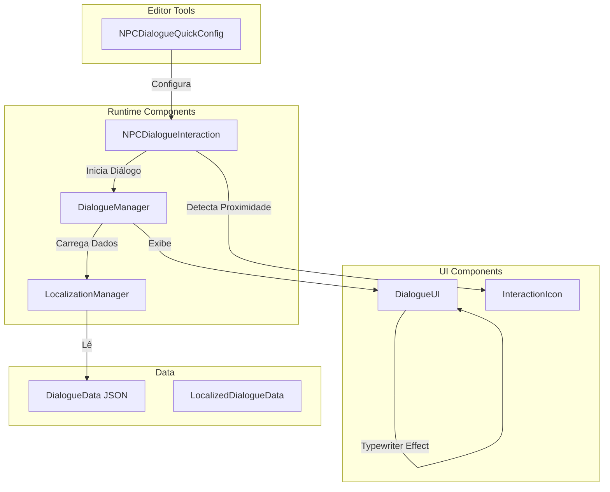
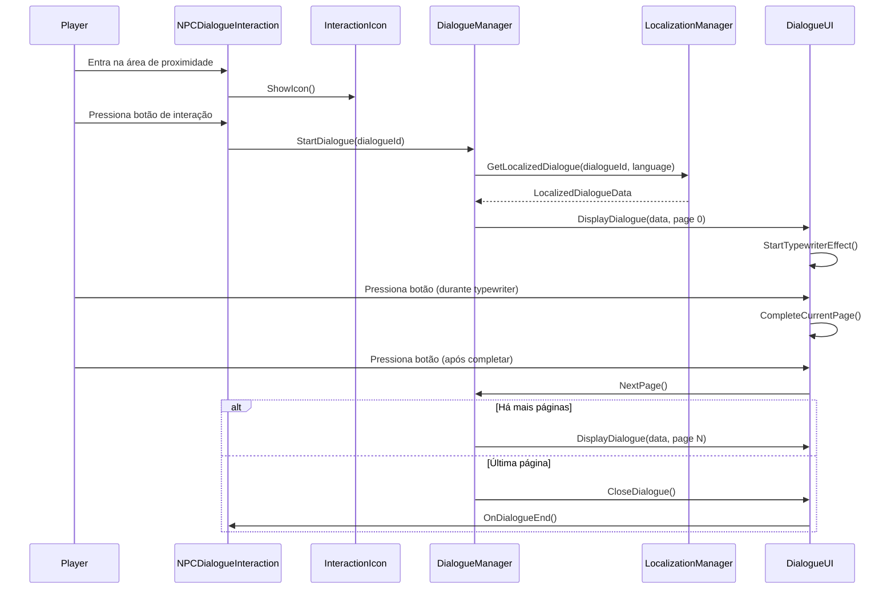

# Design Document - Sistema de Diálogos com NPCs

## Overview

O sistema de diálogos com NPCs será construído sobre a arquitetura existente de NPCs do projeto, estendendo os componentes `NPCDialogue` e `DialogueData` para suportar:

- Configuração rápida via editor (Quick Setup)
- Detecção de proximidade com ícone de interação
- Caixa de diálogo com efeito typewriter
- Carregamento de textos multilíngues de arquivos JSON
- Suporte a paginação de diálogos

O sistema será modular e reutilizará padrões existentes no projeto, como o sistema de Quick Config (similar a `BushQuickConfig` e `ItemQuickConfig`) e o padrão de managers singleton.

## Architecture

### Component Diagram



### System Flow



## Components and Interfaces

### 1. NPCDialogueQuickConfig (Editor Script)

**Localização:** `Assets/Code/Editor/NPCDialogueQuickConfig.cs`

**Responsabilidade:** Ferramenta de editor para configuração rápida de NPCs com sistema de diálogo.

**Funcionalidades:**

- Menu de contexto "GameObject/SlimeKing/Configure as Dialogue NPC"
- Adiciona automaticamente componentes necessários:
  - `NPCDialogueInteraction`
  - `CircleCollider2D` (trigger para detecção de proximidade)
  - Instancia prefab do ícone de interação como filho
- Configura valores padrão (distância de interação, velocidade do typewriter)
- Valida se o GameObject já possui os componentes antes de adicionar

**Interface Pública:**

```csharp
public static class NPCDialogueQuickConfig
{
    [MenuItem("GameObject/SlimeKing/Configure as Dialogue NPC", false, 10)]
    public static void ConfigureAsDialogueNPC(MenuCommand menuCommand);
    
    [MenuItem("GameObject/SlimeKing/Configure as Dialogue NPC", true)]
    public static bool ValidateConfigureAsDialogueNPC();
    
    public static void ConfigureDialogueComponents(GameObject npc);
}
```

### 2. NPCDialogueInteraction (Runtime Component)

**Localização:** `Assets/Code/Gameplay/NPCs/NPCDialogueInteraction.cs`

**Responsabilidade:** Gerencia a detecção de proximidade do jogador e o início de diálogos.

**Funcionalidades:**

- Detecta quando o jogador entra/sai da área de interação
- Exibe/oculta ícone de interação
- Escuta input do jogador para iniciar diálogo
- Comunica-se com o DialogueManager para iniciar/encerrar diálogos

**Propriedades Configuráveis:**

```csharp
[Header("Dialogue Configuration")]
public string dialogueId;                    // ID do diálogo no JSON
public float interactionRadius = 2.5f;       // Raio de detecção
public Transform iconAnchor;                 // Ponto de ancoragem do ícone
public GameObject interactionIconPrefab;     // Prefab do ícone

[Header("Input")]
public string interactionButton = "Interact"; // Nome do botão no Input System
```

**Interface Pública:**

```csharp
public class NPCDialogueInteraction : MonoBehaviour
{
    public void OnPlayerEnterRange();
    public void OnPlayerExitRange();
    public void TryStartDialogue();
    public bool IsPlayerInRange();
}
```

### 3. DialogueManager (Singleton Manager)

**Localização:** `Assets/Code/Systems/Managers/DialogueManager.cs`

**Responsabilidade:** Gerencia o estado global do sistema de diálogos.

**Funcionalidades:**

- Carrega dados de diálogo via LocalizationManager
- Controla o fluxo de páginas do diálogo
- Gerencia o estado ativo/inativo do diálogo
- Pausa/despausa o jogador durante diálogos (opcional)
- Comunica-se com DialogueUI para exibir conteúdo

**Interface Pública:**

```csharp
public class DialogueManager : ManagerSingleton<DialogueManager>
{
    public void StartDialogue(string dialogueId);
    public void NextPage();
    public void EndDialogue();
    public bool IsDialogueActive();
    public int GetCurrentPage();
    public int GetTotalPages();
}
```

### 4. LocalizationManager (Singleton Manager)

**Localização:** `Assets/Code/Systems/Managers/LocalizationManager.cs`

**Responsabilidade:** Gerencia o carregamento e acesso a textos localizados.

**Funcionalidades:**

- Carrega arquivos JSON de diálogos do diretório `Assets/Data/Dialogues/`
- Mantém cache de diálogos carregados
- Retorna texto no idioma configurado com fallback para EN
- Suporta múltiplos idiomas: BR, EN, ES, CH, RS, FR, IT, DT, JP, KR

**Interface Pública:**

```csharp
public class LocalizationManager : ManagerSingleton<LocalizationManager>
{
    public LocalizedDialogueData GetLocalizedDialogue(string dialogueId);
    public void SetLanguage(SystemLanguage language);
    public SystemLanguage GetCurrentLanguage();
    public void ReloadDialogues();
}
```

### 5. DialogueUI (UI Component)

**Localização:** `Assets/Code/Systems/UI/DialogueUI.cs`

**Responsabilidade:** Gerencia a exibição visual da caixa de diálogo.

**Funcionalidades:**

- Exibe/oculta caixa de diálogo
- Implementa efeito typewriter (letra por letra)
- Permite completar texto instantaneamente ao pressionar botão
- Exibe indicador de continuação para páginas múltiplas
- Animações de entrada/saída da caixa

**Propriedades Configuráveis:**

```csharp
[Header("UI References")]
public TextMeshProUGUI dialogueText;
public GameObject dialogueBox;
public GameObject continueIndicator;

[Header("Typewriter Settings")]
public float typewriterSpeed = 50f;  // Caracteres por segundo
public bool skipOnInput = true;

[Header("Animation")]
public float fadeInDuration = 0.3f;
public float fadeOutDuration = 0.3f;
```

**Interface Pública:**

```csharp
public class DialogueUI : MonoBehaviour
{
    public void ShowDialogue(string text, bool hasMorePages);
    public void HideDialogue();
    public void CompleteCurrentText();
    public bool IsTextComplete();
    public bool IsTypewriterActive();
}
```

### 6. InteractionIcon (UI Component)

**Localização:** `Assets/Code/Systems/UI/InteractionIcon.cs`

**Responsabilidade:** Ícone visual que aparece acima do NPC indicando possibilidade de interação.

**Funcionalidades:**

- Segue a posição do NPC em world space
- Animação de bounce/pulse
- Fade in/out suave
- Posicionamento automático acima da cabeça do NPC

**Interface Pública:**

```csharp
public class InteractionIcon : MonoBehaviour
{
    public void Show();
    public void Hide();
    public void SetTarget(Transform target, Vector3 offset);
}
```

## Data Models

### LocalizedDialogueData (ScriptableObject)

**Localização:** `Assets/Code/Gameplay/NPCs/Data/LocalizedDialogueData.cs`

```csharp
[System.Serializable]
public class DialoguePage
{
    public string text;
}

[System.Serializable]
public class LocalizedText
{
    public string language;  // "BR", "EN", "ES", etc.
    public List<DialoguePage> pages;
}

[CreateAssetMenu(fileName = "LocalizedDialogueData", menuName = "Game/Localized Dialogue Data")]
public class LocalizedDialogueData : ScriptableObject
{
    public string dialogueId;
    public string shortDescription;
    public List<LocalizedText> localizations;
    
    public List<DialoguePage> GetPages(string languageCode);
}
```

### JSON Structure

**Localização:** `Assets/Data/Dialogues/*.json`

```json
{
  "dialogueId": "npc_merchant_greeting",
  "shortDescription": "Merchant greeting dialogue",
  "localizations": [
    {
      "language": "EN",
      "pages": [
        { "text": "Welcome, traveler! What brings you to my shop?" },
        { "text": "I have the finest wares in all the land!" }
      ]
    },
    {
      "language": "BR",
      "pages": [
        { "text": "Bem-vindo, viajante! O que te traz à minha loja?" },
        { "text": "Tenho as melhores mercadorias de toda a terra!" }
      ]
    },
    {
      "language": "ES",
      "pages": [
        { "text": "¡Bienvenido, viajero! ¿Qué te trae a mi tienda?" },
        { "text": "¡Tengo las mejores mercancías de toda la tierra!" }
      ]
    }
  ]
}
```

## Error Handling

### Estratégias de Fallback

1. **Idioma não encontrado:**
   - Tenta carregar idioma configurado
   - Se falhar, tenta EN (inglês)
   - Se EN não existir, usa o primeiro idioma disponível
   - Se nenhum idioma disponível, exibe mensagem de erro padrão

2. **Arquivo JSON não encontrado:**
   - Loga erro no console com caminho esperado
   - Exibe mensagem padrão na UI: "[Dialogue not found]"
   - Não quebra o jogo, permite continuar

3. **JSON malformado:**
   - Captura exceção de parsing
   - Loga erro detalhado no console
   - Exibe mensagem de erro na UI
   - Registra o arquivo problemático para debug

4. **Componentes faltando:**
   - Valida componentes necessários no Awake/Start
   - Loga warnings claros indicando o que está faltando
   - Desabilita funcionalidade gracefully se componentes críticos estão ausentes

### Logging Strategy

```csharp
// Exemplos de logs
Debug.LogWarning($"[DialogueSystem] Dialogue '{dialogueId}' not found. Using fallback.");
Debug.LogError($"[DialogueSystem] Failed to parse JSON file: {filePath}. Error: {ex.Message}");
Debug.Log($"[DialogueSystem] Loaded {count} dialogues successfully.");
```

## Testing Strategy

### Unit Tests (Opcional)

1. **LocalizationManager Tests:**
   - Teste de carregamento de JSON válido
   - Teste de fallback de idioma
   - Teste de cache de diálogos
   - Teste de JSON malformado

2. **DialogueManager Tests:**
   - Teste de navegação entre páginas
   - Teste de início/fim de diálogo
   - Teste de estado ativo/inativo

### Integration Tests (Opcional)

1. **Fluxo completo de diálogo:**
   - Jogador se aproxima do NPC
   - Ícone aparece
   - Jogador pressiona botão
   - Diálogo é exibido com typewriter
   - Navegação entre páginas
   - Fechamento do diálogo

### Manual Testing Checklist

1. **Quick Setup:**
   - [ ] Menu aparece no contexto correto
   - [ ] Componentes são adicionados corretamente
   - [ ] Valores padrão são configurados
   - [ ] Não duplica componentes existentes

2. **Detecção de Proximidade:**
   - [ ] Ícone aparece ao se aproximar
   - [ ] Ícone desaparece ao se afastar
   - [ ] Raio de detecção é visualizado no editor (gizmos)

3. **Diálogo:**
   - [ ] Caixa de diálogo aparece ao pressionar botão
   - [ ] Efeito typewriter funciona corretamente
   - [ ] Pressionar botão durante typewriter completa o texto
   - [ ] Pressionar botão após completar avança para próxima página
   - [ ] Última página fecha o diálogo
   - [ ] Diálogo de página única fecha corretamente

4. **Localização:**
   - [ ] Textos carregam no idioma correto
   - [ ] Fallback para EN funciona
   - [ ] Troca de idioma em runtime funciona
   - [ ] Erros de JSON são tratados gracefully

5. **Performance:**
   - [ ] Sem lag ao exibir texto longo
   - [ ] Carregamento de JSON não trava o jogo
   - [ ] Múltiplos NPCs com diálogos não causam problemas

## Implementation Notes

### Integração com Sistema Existente

O sistema será integrado com os componentes existentes:

1. **NPCDialogue.cs:** Será estendido ou substituído por `NPCDialogueInteraction`
2. **DialogueData.cs:** Será mantido para compatibilidade, mas `LocalizedDialogueData` será usado para novos diálogos
3. **PlayerController:** Será usado para detectar proximidade e capturar input
4. **Input System:** Usará o Input System do Unity já configurado no projeto

### Prefabs Necessários

1. **DialogueUI Prefab:**
   - Canvas com caixa de diálogo
   - TextMeshPro para texto
   - Indicador de continuação
   - Componente DialogueUI

2. **InteractionIcon Prefab:**
   - Sprite do ícone (ex: botão "E" ou "Interact")
   - Componente InteractionIcon
   - Animator para animação de bounce

### Estrutura de Pastas

```
Assets/
├── Code/
│   ├── Editor/
│   │   └── NPCDialogueQuickConfig.cs
│   ├── Gameplay/
│   │   └── NPCs/
│   │       ├── NPCDialogueInteraction.cs
│   │       └── Data/
│   │           └── LocalizedDialogueData.cs
│   └── Systems/
│       ├── Managers/
│       │   ├── DialogueManager.cs
│       │   └── LocalizationManager.cs
│       └── UI/
│           ├── DialogueUI.cs
│           └── InteractionIcon.cs
├── Data/
│   └── Dialogues/
│       ├── npc_merchant_greeting.json
│       ├── npc_guard_warning.json
│       └── ...
└── Game/
    └── Prefabs/
        └── UI/
            ├── DialogueUI.prefab
            └── InteractionIcon.prefab
```

### Configurações Globais

Criar um ScriptableObject para configurações globais do sistema:

```csharp
[CreateAssetMenu(fileName = "DialogueSystemSettings", menuName = "Game/Dialogue System Settings")]
public class DialogueSystemSettings : ScriptableObject
{
    [Header("Paths")]
    public string dialoguesPath = "Assets/Data/Dialogues/";
    
    [Header("Default Values")]
    public float defaultTypewriterSpeed = 50f;
    public float defaultInteractionRadius = 2.5f;
    public SystemLanguage defaultLanguage = SystemLanguage.English;
    
    [Header("Prefabs")]
    public GameObject dialogueUIPrefab;
    public GameObject interactionIconPrefab;
    
    [Header("Input")]
    public string interactionButtonName = "Interact";
}
```

### Performance Considerations

1. **Caching:** Diálogos carregados são mantidos em cache para evitar leitura repetida de arquivos
2. **Object Pooling:** Considerar pooling para ícones de interação se houver muitos NPCs
3. **Coroutines:** Usar coroutines para efeito typewriter para não bloquear a thread principal
4. **Lazy Loading:** Carregar diálogos sob demanda, não todos no início

### Extensibilidade

O sistema é projetado para ser facilmente extensível:

1. **Novos idiomas:** Adicionar novos códigos de idioma no enum e nos JSONs
2. **Efeitos de texto:** DialogueUI pode ser estendido com efeitos adicionais (shake, color, etc.)
3. **Áudio:** Adicionar suporte para voice-over ou sons de typewriter
4. **Portraits:** Adicionar suporte para retratos de NPCs na caixa de diálogo
5. **Choices:** Estender para suportar escolhas do jogador (já existe estrutura em DialogueData.cs)
