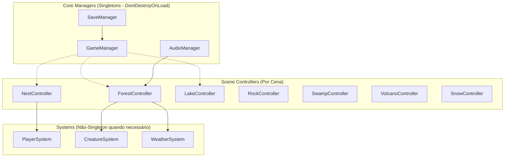
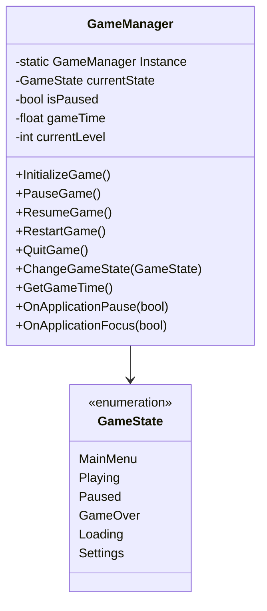
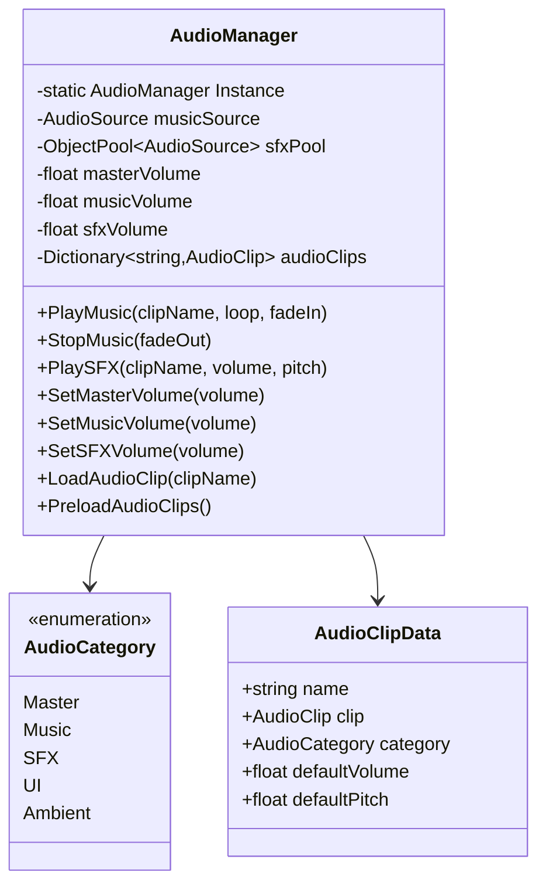
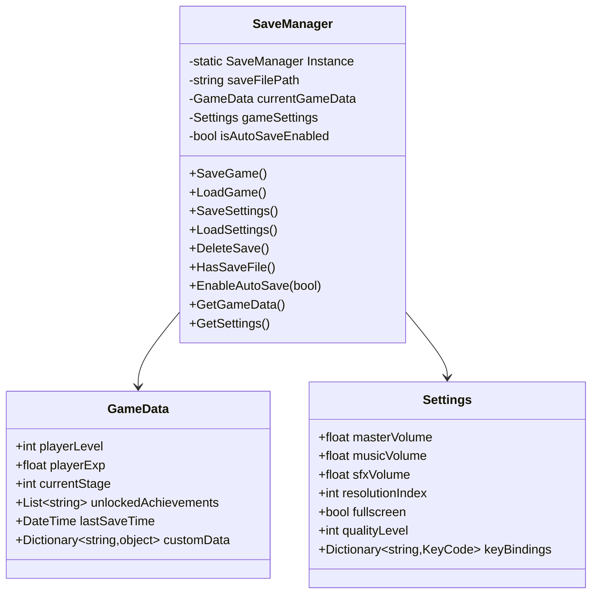
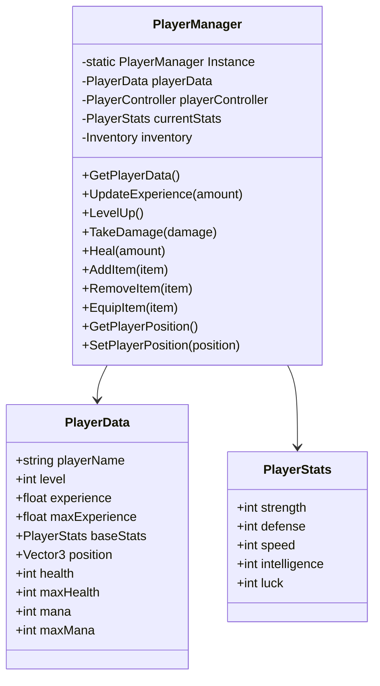
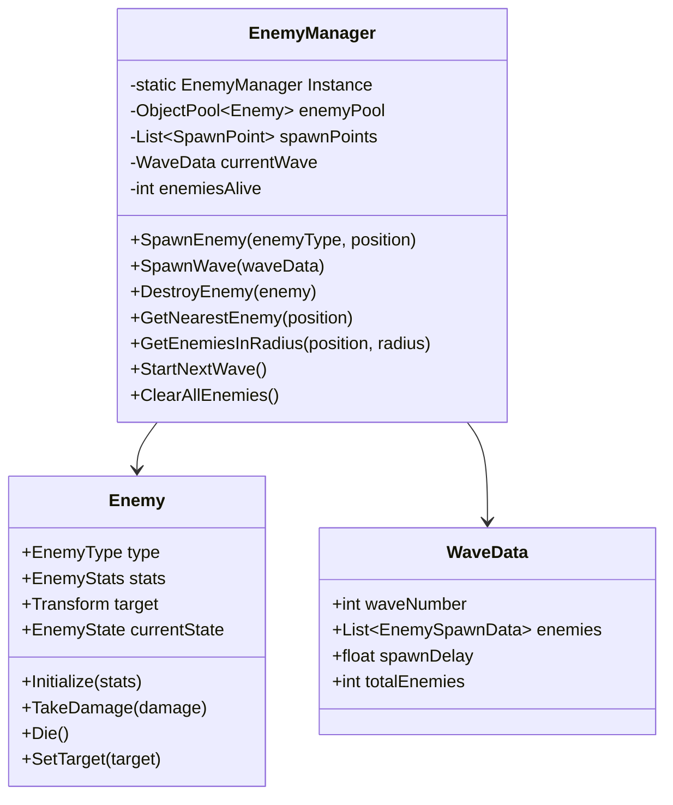
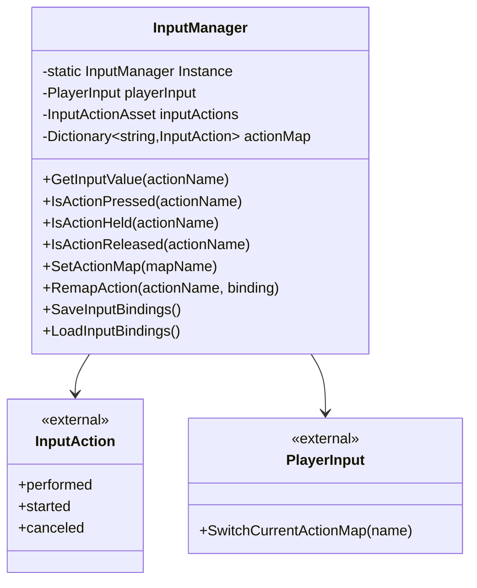
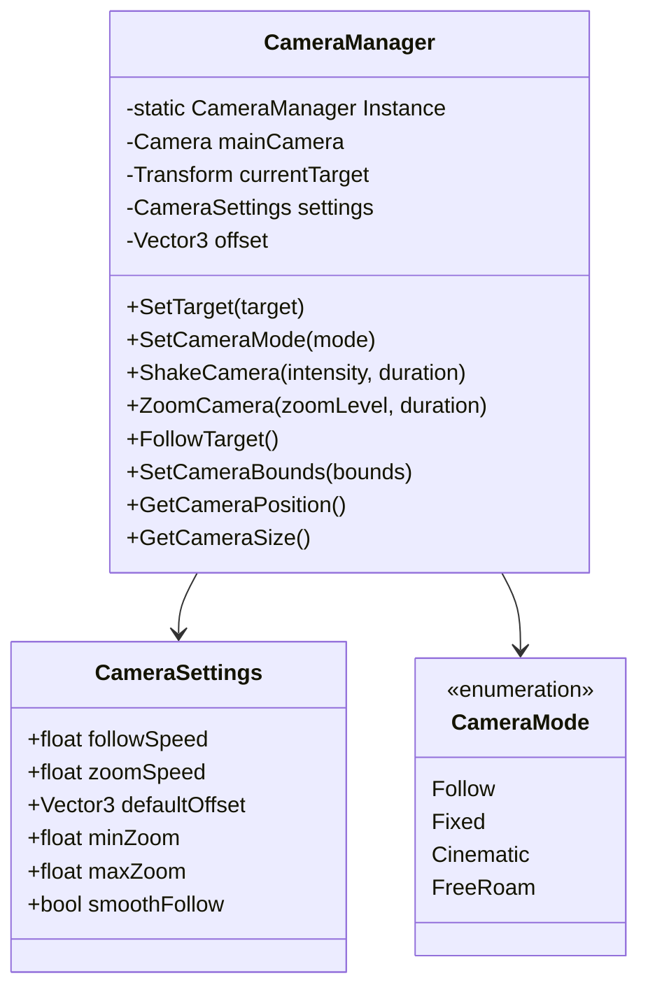
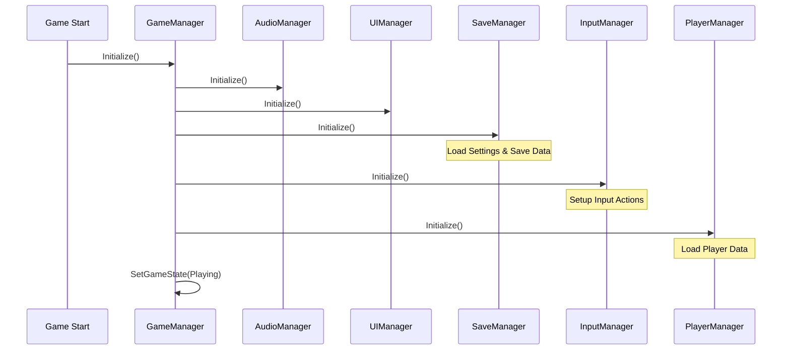

# 🏗️ **Managers Design Document - The Slime King**

## 📋 **Índice**

1. [Visão Geral da Arquitetura](#visão-geral-da-arquitetura)
2. [Core Managers (Singletons)](#core-managers-singletons)
   - [GameManager](#gamemanager)
   - [AudioManager](#audiomanager)
   - [SaveManager](#savemanager)
3. [Scene Controllers](#scene-controllers)
   - [Estrutura de Controllers](#estrutura-de-controllers)
   - [Exemplos por Bioma](#exemplos-por-bioma)
4. [Padrões de Implementação](#padrões-de-implementação)
5. [Fluxo de Inicialização](#fluxo-de-inicialização)

---

## 🎯 **Visão Geral da Arquitetura Simplificada**

### **Princípios de Design**

1. **🎯 Simplicidade Primeiro**: Apenas 3 Managers Singleton essenciais
2. **🔗 Baixo Acoplamento**: Managers independentes entre si
3. **📈 Alta Coesão**: Responsabilidades claras e específicas
4. **🎮 Controller por Cena**: Cada bioma/cena tem seu próprio Controller
5. **⚡ Performance**: Evitar overhead desnecessário
6. **🐛 Debugging**: Logs opcionais e controlados

### **Arquitetura Simplificada**



---

## 🎮 **Tier 1: Core Managers**

### **GameManager**

#### **📖 Responsabilidades**

- Coordenação geral do estado do jogo
- Controle do ciclo de vida da aplicação
- Gerenciamento de estados globais (Pause, Menu, Playing)
- Coordenação entre outros managers

#### **🏗️ Design**



#### **📁 Estrutura**

```
Assets/Scripts/Core/GameManager.cs
Assets/Scripts/Core/GameState.cs
```

#### **🔧 Implementação Base**

```csharp
namespace SlimeKing.Core
{
    public class GameManager : MonoBehaviour
    {
        public static GameManager Instance { get; private set; }
        
        [Header("Game State")]
        [SerializeField] private GameState currentState = GameState.MainMenu;
        [SerializeField] private bool isPaused = false;
        
        [Header("Game Data")]
        [SerializeField] private float gameTime = 0f;
        [SerializeField] private int currentLevel = 1;
        
        [Header("Events")]
        public UnityEvent<GameState> OnGameStateChanged;
        public UnityEvent OnGamePaused;
        public UnityEvent OnGameResumed;
        
        private void Awake()
        {
            if (Instance == null)
            {
                Instance = this;
                DontDestroyOnLoad(gameObject);
                InitializeGame();
            }
            else
            {
                Destroy(gameObject);
            }
        }
        
        public void InitializeGame()
        {
            // Inicialização dos managers dependentes
            Debug.Log("[GameManager] Game initialized");
        }
        
        public void ChangeGameState(GameState newState)
        {
            if (currentState != newState)
            {
                currentState = newState;
                OnGameStateChanged?.Invoke(newState);
                Debug.Log($"[GameManager] State changed to: {newState}");
            }
        }
    }
}
```

---

### **AudioManager**

#### **📖 Responsabilidades**

- Reprodução de música e efeitos sonoros
- Controle de volume global e por categoria
- Gerenciamento de AudioSources pool
- Configurações de áudio persistentes

#### **🏗️ Design**



#### **📁 Estrutura**

```
Assets/Scripts/Core/AudioManager.cs
Assets/Scripts/Core/AudioCategory.cs
Assets/Scripts/Core/AudioClipData.cs
Assets/Resources/Audio/Music/
Assets/Resources/Audio/SFX/
Assets/Resources/Audio/UI/
```

#### **🔧 Implementação Base**

```csharp
namespace SlimeKing.Core
{
    public class AudioManager : MonoBehaviour
    {
        public static AudioManager Instance { get; private set; }
        
        [Header("Audio Sources")]
        [SerializeField] private AudioSource musicSource;
        [SerializeField] private AudioSource[] sfxSources;
        
        [Header("Volume Settings")]
        [Range(0f, 1f)] public float masterVolume = 1f;
        [Range(0f, 1f)] public float musicVolume = 0.8f;
        [Range(0f, 1f)] public float sfxVolume = 1f;
        
        [Header("Audio Clips")]
        [SerializeField] private AudioClipData[] audioClips;
        
        private Dictionary<string, AudioClip> clipDictionary;
        private int currentSFXIndex = 0;
        
        private void Awake()
        {
            if (Instance == null)
            {
                Instance = this;
                DontDestroyOnLoad(gameObject);
                InitializeAudio();
            }
            else
            {
                Destroy(gameObject);
            }
        }
        
        private void InitializeAudio()
        {
            clipDictionary = new Dictionary<string, AudioClip>();
            foreach (var clipData in audioClips)
            {
                clipDictionary[clipData.name] = clipData.clip;
            }
            LoadVolumeSettings();
        }
        
        public void PlayMusic(string clipName, bool loop = true, float fadeInTime = 0f)
        {
            if (clipDictionary.TryGetValue(clipName, out AudioClip clip))
            {
                musicSource.clip = clip;
                musicSource.loop = loop;
                musicSource.volume = musicVolume * masterVolume;
                musicSource.Play();
            }
        }
        
        public void PlaySFX(string clipName, float volume = 1f, float pitch = 1f)
        {
            if (clipDictionary.TryGetValue(clipName, out AudioClip clip))
            {
                AudioSource source = sfxSources[currentSFXIndex];
                source.clip = clip;
                source.volume = volume * sfxVolume * masterVolume;
                source.pitch = pitch;
                source.Play();
                
                currentSFXIndex = (currentSFXIndex + 1) % sfxSources.Length;
            }
        }
    }
}
```

---

### **UIManager**

#### **📖 Responsabilidades**

- Transições entre cenas com efeitos visuais
- Controle de elementos UI globais
- Sistema de fade para objetos e canvas groups
- Gerenciamento de overlays e popups

#### **🏗️ Design**

*[Já implementado - ver Assets/Scripts/Systems/UI/UIManager.cs]*

---

### **SaveManager**

#### **📖 Responsabilidades**

- Persistência de dados do jogador
- Configurações do jogo
- Progresso e conquistas
- Serialização/Deserialização segura

#### **🏗️ Design**



#### **📁 Estrutura**

```
Assets/Scripts/Core/SaveManager.cs
Assets/Scripts/Core/GameData.cs
Assets/Scripts/Core/Settings.cs
```

#### **🔧 Implementação Base**

```csharp
namespace SlimeKing.Core
{
    public class SaveManager : MonoBehaviour
    {
        public static SaveManager Instance { get; private set; }
        
        [Header("Save Settings")]
        [SerializeField] private bool encryptSaveData = true;
        [SerializeField] private bool autoSaveEnabled = true;
        [SerializeField] private float autoSaveInterval = 300f; // 5 minutos
        
        private GameData currentGameData;
        private Settings gameSettings;
        private string saveFilePath;
        private string settingsFilePath;
        
        private void Awake()
        {
            if (Instance == null)
            {
                Instance = this;
                DontDestroyOnLoad(gameObject);
                InitializeSaveSystem();
            }
            else
            {
                Destroy(gameObject);
            }
        }
        
        private void InitializeSaveSystem()
        {
            saveFilePath = Path.Combine(Application.persistentDataPath, "savegame.dat");
            settingsFilePath = Path.Combine(Application.persistentDataPath, "settings.dat");
            
            LoadSettings();
            
            if (autoSaveEnabled)
            {
                InvokeRepeating(nameof(AutoSave), autoSaveInterval, autoSaveInterval);
            }
        }
        
        public void SaveGame()
        {
            try
            {
                string jsonData = JsonUtility.ToJson(currentGameData, true);
                
                if (encryptSaveData)
                {
                    jsonData = EncryptString(jsonData);
                }
                
                File.WriteAllText(saveFilePath, jsonData);
                Debug.Log("[SaveManager] Game saved successfully");
            }
            catch (Exception e)
            {
                Debug.LogError($"[SaveManager] Failed to save game: {e.Message}");
            }
        }
        
        public bool LoadGame()
        {
            try
            {
                if (File.Exists(saveFilePath))
                {
                    string jsonData = File.ReadAllText(saveFilePath);
                    
                    if (encryptSaveData)
                    {
                        jsonData = DecryptString(jsonData);
                    }
                    
                    currentGameData = JsonUtility.FromJson<GameData>(jsonData);
                    Debug.Log("[SaveManager] Game loaded successfully");
                    return true;
                }
            }
            catch (Exception e)
            {
                Debug.LogError($"[SaveManager] Failed to load game: {e.Message}");
            }
            
            // Se falhar, cria um novo save
            currentGameData = new GameData();
            return false;
        }
    }
}
```

---

## 🎮 **Tier 2: Gameplay Managers**

### **PlayerManager**

#### **📖 Responsabilidades**

- Estado e estatísticas do jogador
- Sistema de progressão (level, experiência)
- Inventário e equipamentos
- Habilidades e skills

#### **🏗️ Design**



#### **📁 Estrutura**

```
Assets/Scripts/Gameplay/PlayerManager.cs
Assets/Scripts/Gameplay/PlayerData.cs
Assets/Scripts/Gameplay/PlayerStats.cs
Assets/Scripts/Gameplay/Inventory.cs
```

---

### **EnemyManager**

#### **📖 Responsabilidades**

- Spawn e controle de inimigos
- Pool de objetos para otimização
- Sistema de ondas e dificuldade progressiva
- IA comportamental básica

#### **🏗️ Design**



---

## 🔧 **Tier 3: System Managers**

### **InputManager**

#### **📖 Responsabilidades**

- Abstração do sistema de input
- Mapeamento de controles customizáveis
- Suporte para múltiplos dispositivos (teclado, gamepad)
- Sistema de ações contextuais

#### **🏗️ Design**



#### **📁 Estrutura**

```
Assets/Scripts/Systems/InputManager.cs
Assets/InputSystem_Actions.inputactions
```

---

### **CameraManager**

#### **📖 Responsabilidades**

- Controle de câmeras do jogo
- Sistema de follow e tracking
- Transições suaves entre targets
- Efeitos de shake e zoom

#### **🏗️ Design**



---

## 🎯 **Padrões de Implementação**

### **Singleton Base Class**

```csharp
namespace SlimeKing.Core
{
    public abstract class ManagerBase<T> : MonoBehaviour where T : ManagerBase<T>
    {
        public static T Instance { get; private set; }
        
        [Header("Manager Settings")]
        [SerializeField] protected bool enableDebugLogs = true;
        [SerializeField] protected bool persistBetweenScenes = true;
        
        protected virtual void Awake()
        {
            if (Instance == null)
            {
                Instance = (T)this;
                
                if (persistBetweenScenes)
                {
                    DontDestroyOnLoad(gameObject);
                }
                
                Initialize();
            }
            else
            {
                Destroy(gameObject);
            }
        }
        
        protected abstract void Initialize();
        
        protected virtual void Log(string message)
        {
            if (enableDebugLogs)
            {
                Debug.Log($"[{typeof(T).Name}] {message}");
            }
        }
        
        protected virtual void LogError(string message)
        {
            Debug.LogError($"[{typeof(T).Name}] {message}");
        }
    }
}
```

### **Event System Pattern**

```csharp
// Exemplo de uso em GameManager
public class GameManager : ManagerBase<GameManager>
{
    [Header("Events")]
    public UnityEvent<GameState> OnGameStateChanged;
    public UnityEvent<int> OnLevelChanged;
    public UnityEvent<float> OnHealthChanged;
    
    // Outros managers podem se inscrever nos eventos
    private void Start()
    {
        OnGameStateChanged.AddListener(HandleStateChange);
    }
    
    private void HandleStateChange(GameState newState)
    {
        Log($"Game state changed to: {newState}");
    }
}
```

---

## 🚀 **Fluxo de Inicialização**

### **Ordem de Inicialização**



### **Manager Initialization Script**

```csharp
namespace SlimeKing.Core
{
    public class ManagerInitializer : MonoBehaviour
    {
        [Header("Manager Prefabs")]
        [SerializeField] private GameObject gameManagerPrefab;
        [SerializeField] private GameObject audioManagerPrefab;
        [SerializeField] private GameObject uiManagerPrefab;
        [SerializeField] private GameObject saveManagerPrefab;
        [SerializeField] private GameObject inputManagerPrefab;
        
        private void Awake()
        {
            InitializeManagers();
        }
        
        private void InitializeManagers()
        {
            // Tier 1: Core Managers
            InstantiateManager<GameManager>(gameManagerPrefab);
            InstantiateManager<AudioManager>(audioManagerPrefab);
            InstantiateManager<UIManager>(uiManagerPrefab);
            InstantiateManager<SaveManager>(saveManagerPrefab);
            
            // Tier 3: System Managers
            InstantiateManager<InputManager>(inputManagerPrefab);
            
            Debug.Log("[ManagerInitializer] All managers initialized");
        }
        
        private void InstantiateManager<T>(GameObject prefab) where T : MonoBehaviour
        {
            if (FindObjectOfType<T>() == null && prefab != null)
            {
                Instantiate(prefab);
            }
        }
    }
}
```

---

## 📊 **Resumo da Arquitetura**

| **Manager** | **Tier** | **Responsabilidade Principal** | **Dependências** |
|-------------|----------|--------------------------------|------------------|
| **GameManager** | Core | Coordenação geral e estados | Nenhuma |
| **AudioManager** | Core | Sistema de áudio | Nenhuma |
| **UIManager** | Core | Interface e transições | Nenhuma |
| **SaveManager** | Core | Persistência de dados | Nenhuma |
| **PlayerManager** | Gameplay | Estado do jogador | InputManager |
| **EnemyManager** | Gameplay | Controle de inimigos | PlayerManager |
| **InputManager** | System | Entrada do usuário | Nenhuma |
| **CameraManager** | System | Controle de câmera | PlayerManager |

---
