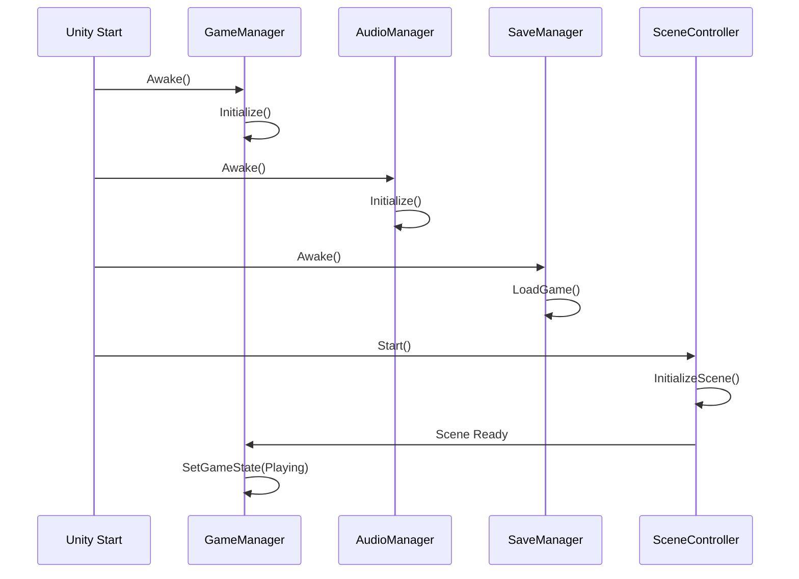

# 🏗️ **Managers Design Document v2.0 - The Slime King**

## 📋 **Princípios da Arquitetura Simplificada**

1. **🎯 Apenas 3 Managers Singleton** - Evitar over-engineering
2. **🎮 Controller por Cena** - Cada bioma tem seu controller específico
3. **🔗 Baixo Acoplamento** - Comunicação via eventos
4. **⚡ Performance First** - Sem inicializações desnecessárias
5. **🐛 Debug Opcional** - Logs controlados via inspector

---

## 🎮 **Core Managers (Singletons)**

### **GameManager**

**Único responsável pelo estado global do jogo e coordenação entre cenas.**

#### **Responsabilidades Essenciais**

- **Estado do Jogo**: Playing, Paused, MainMenu, GameOver
- **Ciclo Temporal**: Dia/noite, estações, clima
- **Transições de Cena**: Carregar biomas, manter estado
- **Evolução do Slime**: Coordenar progressão global
- **Eventos Globais**: Comunicação entre sistemas

#### **Estrutura Base**

```csharp
namespace SlimeKing.Core
{
    public class GameManager : MonoBehaviour
    {
        public static GameManager Instance { get; private set; }
        
        [Header("Game State")]
        [SerializeField] private GameState currentState = GameState.Playing;
        [SerializeField] private bool isPaused = false;
        
        [Header("Time System")]
        [SerializeField] private float gameTime = 0f;
        [SerializeField] private int currentDay = 1;
        [SerializeField] private Season currentSeason = Season.Spring;
        [SerializeField] private WeatherType currentWeather = WeatherType.Clear;
        
        [Header("Slime Evolution")]
        [SerializeField] private SlimeStage currentStage = SlimeStage.Baby;
        [SerializeField] private Dictionary<ElementType, int> elementalXP;
        
        [Header("Events")]
        public static event Action<GameState> OnGameStateChanged;
        public static event Action<float> OnTimeAdvanced;
        public static event Action<Season> OnSeasonChanged;
        public static event Action<WeatherType> OnWeatherChanged;
        public static event Action<SlimeStage> OnSlimeEvolved;
        
        private void Awake()
        {
            if (Instance == null)
            {
                Instance = this;
                DontDestroyOnLoad(gameObject);
            }
            else
            {
                Destroy(gameObject);
            }
        }
        
        public void ChangeGameState(GameState newState) { }
        public void AdvanceTime(float deltaTime) { }
        public void EvolveSlime() { }
    }
}
```

#### **Estados do Jogo**

```csharp
public enum GameState
{
    MainMenu,
    Playing,
    Paused,
    Loading,
    Settings
}

public enum SlimeStage
{
    Baby,
    Adult, 
    Large,
    King
}
```

---

### **AudioManager**

**Gerencia música e efeitos sonoros com sistema de pool otimizado.**

#### **Responsabilidades Essenciais**

- **Música de Fundo**: Por bioma, adaptativa ao clima/estação
- **Efeitos Sonoros**: Pool de AudioSources para performance
- **Volume Global**: Master, Music, SFX separados
- **Variações**: Múltiplas versões para evitar repetição

#### **Estrutura Base**

```csharp
namespace SlimeKing.Core
{
    public class AudioManager : MonoBehaviour
    {
        public static AudioManager Instance { get; private set; }
        
        [Header("Audio Sources")]
        [SerializeField] private AudioSource musicSource;
        [SerializeField] private AudioSource[] sfxPool = new AudioSource[10];
        
        [Header("Volume Settings")]
        [Range(0f, 1f)] public float masterVolume = 1f;
        [Range(0f, 1f)] public float musicVolume = 0.8f;
        [Range(0f, 1f)] public float sfxVolume = 1f;
        
        [Header("Audio Collections")]
        [SerializeField] private AudioClip[] musicTracks;
        [SerializeField] private AudioClip[] sfxClips;
        
        [Header("Debug")]
        [SerializeField] private bool enableDebugLogs = false;
        
        private int currentSFXIndex = 0;
        
        private void Awake()
        {
            if (Instance == null)
            {
                Instance = this;
                DontDestroyOnLoad(gameObject);
                InitializeAudioSources();
            }
            else
            {
                Destroy(gameObject);
            }
        }
        
        public void PlayMusic(string trackName, bool loop = true) { }
        public void PlaySFX(string clipName, float volume = 1f) { }
        public void SetMasterVolume(float volume) { }
        public void StopMusic(float fadeTime = 0f) { }
        
        private void InitializeAudioSources() { }
        private AudioSource GetAvailableSFXSource() { return sfxPool[currentSFXIndex]; }
    }
}
```

---

### **SaveManager**

**Sistema de persistência simples e seguro para progressão do slime.**

#### **Responsabilidades Essenciais**

- **Save/Load**: Dados do jogador e configurações
- **Progressão**: Estado da evolução, cristais coletados
- **Configurações**: Volume, controles, qualidade gráfica
- **Segurança**: Validação básica contra corrupção

#### **Estrutura Base**

```csharp
namespace SlimeKing.Core
{
    public class SaveManager : MonoBehaviour
    {
        public static SaveManager Instance { get; private set; }
        
        [Header("Save Settings")]
        [SerializeField] private string saveFileName = "slime_save.json";
        [SerializeField] private bool autoSave = true;
        [SerializeField] private float autoSaveInterval = 300f; // 5 minutes
        
        [Header("Debug")]
        [SerializeField] private bool enableDebugLogs = false;
        
        private GameData currentSaveData;
        private string savePath;
        
        private void Awake()
        {
            if (Instance == null)
            {
                Instance = this;
                DontDestroyOnLoad(gameObject);
                savePath = Path.Combine(Application.persistentDataPath, saveFileName);
            }
            else
            {
                Destroy(gameObject);
            }
        }
        
        public void SaveGame() { }
        public void LoadGame() { }
        public GameData GetCurrentSaveData() { return currentSaveData; }
        public void DeleteSave() { }
        
        private void ValidateSaveData() { }
    }
    
    [System.Serializable]
    public class GameData
    {
        public SlimeStage slimeStage = SlimeStage.Baby;
        public Dictionary<ElementType, int> elementalXP = new();
        public List<string> unlockedBiomes = new();
        public Dictionary<string, bool> achievements = new();
        public int totalPlayTime = 0;
        public DateTime lastSaveTime;
        
        // Settings
        public float masterVolume = 1f;
        public float musicVolume = 0.8f;
        public float sfxVolume = 1f;
    }
}
```

---

## 🎯 **Scene Controllers**

### **Estrutura Base do Controller**

**Cada bioma/cena tem seu próprio Controller para gerenciar elementos específicos.**

```csharp
namespace SlimeKing.Controllers
{
    public abstract class SceneControllerBase : MonoBehaviour
    {
        [Header("Scene Info")]
        [SerializeField] protected string sceneName;
        [SerializeField] protected BiomeType biomeType;
        
        [Header("References")]
        [SerializeField] protected Transform playerSpawnPoint;
        [SerializeField] protected Camera sceneCamera;
        
        [Header("Debug")]
        [SerializeField] protected bool enableDebugLogs = false;
        
        protected virtual void Awake() { }
        protected virtual void Start() { }
        protected virtual void OnDestroy() { }
        
        public abstract void InitializeScene();
        public abstract void CleanupScene();
        
        protected void Log(string message)
        {
            if (enableDebugLogs)
                Debug.Log($"[{sceneName}] {message}");
        }
    }
}
```

### **Exemplos de Controllers por Bioma**

#### **NestController** (Ninho do Slime)

```csharp
public class NestController : SceneControllerBase
{
    [Header("Nest Specific")]
    [SerializeField] private NestExpansionSystem expansionSystem;
    [SerializeField] private Transform[] expansionPoints;
    
    public override void InitializeScene()
    {
        // Tutorial, spawns, expansões do lar
    }
}
```

#### **ForestController** (Floresta Calma)

```csharp
public class ForestController : SceneControllerBase
{
    [Header("Forest Specific")]
    [SerializeField] private CreatureSpawner creatureSpawner;
    [SerializeField] private WeatherSystem weatherSystem;
    [SerializeField] private CrystalSpawner crystalSpawner;
    
    public override void InitializeScene()
    {
        // Criaturas, clima, cristais da floresta
    }
}
```

#### **LakeController** (Lago Espelhado)

```csharp
public class LakeController : SceneControllerBase
{
    [Header("Lake Specific")]
    [SerializeField] private WaterSystem waterSystem;
    [SerializeField] private ReflectionSystem reflectionSystem;
    
    public override void InitializeScene()
    {
        // Sistema aquático, reflexos, criaturas aquáticas
    }
}
```

---

## 🔄 **Padrões de Implementação**

### **Singleton Base Class**

```csharp
namespace SlimeKing.Core
{
    public abstract class ManagerSingleton<T> : MonoBehaviour where T : ManagerSingleton<T>
    {
        public static T Instance { get; private set; }
        
        [Header("Manager Base")]
        [SerializeField] protected bool enableDebugLogs = false;
        
        protected virtual void Awake()
        {
            if (Instance == null)
            {
                Instance = (T)this;
                DontDestroyOnLoad(gameObject);
                Initialize();
            }
            else
            {
                Destroy(gameObject);
            }
        }
        
        protected abstract void Initialize();
        
        protected void Log(string message)
        {
            if (enableDebugLogs)
                Debug.Log($"[{typeof(T).Name}] {message}");
        }
    }
}
```

### **Sistema de Eventos**

```csharp
namespace SlimeKing.Events
{
    public static class GameEvents
    {
        // Game State Events
        public static event Action<GameState> OnGameStateChanged;
        public static event Action OnGamePaused;
        public static event Action OnGameResumed;
        
        // Slime Evolution Events
        public static event Action<SlimeStage> OnSlimeEvolved;
        public static event Action<ElementType, int> OnElementalXPGained;
        
        // Scene Events
        public static event Action<string> OnSceneLoaded;
        public static event Action<BiomeType> OnBiomeEntered;
        
        // Audio Events
        public static event Action<string> OnPlayMusic;
        public static event Action<string> OnPlaySFX;
        
        // Save Events
        public static event Action OnGameSaved;
        public static event Action OnGameLoaded;
    }
}
```

---

## 🚀 **Fluxo de Inicialização Simplificado**



---

## 📊 **Resumo da Arquitetura Simplificada**

| **Componente** | **Tipo** | **Responsabilidade** | **Localização** |
|----------------|----------|----------------------|-----------------|
| **GameManager** | Singleton | Estado global, tempo, evolução | DontDestroyOnLoad |
| **AudioManager** | Singleton | Música e SFX | DontDestroyOnLoad |
| **SaveManager** | Singleton | Persistência | DontDestroyOnLoad |
| **NestController** | Scene | Lar do slime, tutorial | Cena do Ninho |
| **ForestController** | Scene | Floresta, criaturas | Cena da Floresta |
| **LakeController** | Scene | Lago, aquáticos | Cena do Lago |
| **RockController** | Scene | Montanhas, minerais | Cena Rochosa |
| **SwampController** | Scene | Pântano, névoas | Cena do Pântano |
| **VolcanoController** | Scene | Lava, fogo | Cena Vulcânica |
| **SnowController** | Scene | Neve, gelo | Cena Nevada |

---

## 🎯 **Benefícios da Simplificação**

1. **Menos Arquivos**: 3 Managers + 7 Controllers vs 8+ Managers
2. **Menos Dependências**: Comunicação via eventos, não referências diretas
3. **Melhor Performance**: Sem managers desnecessários rodando
4. **Manutenção Simples**: Responsabilidades claras e específicas
5. **Escalabilidade**: Fácil adicionar novos biomas com Controllers
6. **Debug Eficiente**: Logs opcionais por componente
